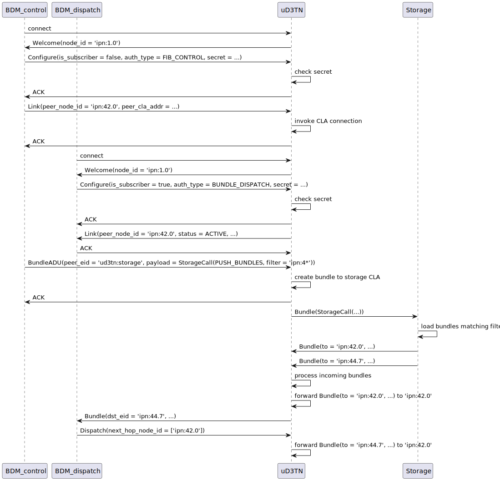

# AAP 2.0

AAP is *the* interface for applications to interact with the µD3TN BPA.
*Applications* in this context may be bundle sources/sinks, dispatchers ("BDMs"), discovery daemons, and other services controlling the BPA operations.

[[_TOC_]]

## Core Objectives of AAP 2.0

- Sending and receiving bundles (incl. controlling necessary metadata)
- Control the forwarding logic (FIB)
- Inform applications of changes (new bundles, connections, etc.) asynchonously
- Map received bundles to next hops (dispatch bundles - see the [paper](https://arxiv.org/abs/2209.05039) for details)

**Additional requirements:**

- It must be easy to write agents / apps (-> one interface without complex semantics)
- Low overhead
- Small set of dependencies
- Option to port it to a microcontroller in the future

**Notes:**

- Please refer to [**the current Protobuf source**](../components/aap2/aap2.proto) for a definition of the messages and structures described here.
- AAP 2.0 currently **excludes the handling of persistent storage and proactive fragmentation**. See the dedicated sections of this document on such considerations below - storage is assumed to be a specific type of CLA that gets an own "node ID", i.e., an EID via which it is reachable using bundles sent over AAP.
- Some future extensions have been already considered but are not recommended for the first iteration for the sake of keeping it minimal. There are marked with `FUTURE EXTENSION`.

## Vision

AAP 2.0 should allow for drastically simplifying and increasing flexibility of the core of the Bundle Protocol Agent (BPA), by delegating all operations that are not essential for immediate bundle forwarding to its clients.

## Interface Summary

AAP 2.0 is an **RPC-like interface**: a command is sent, along with all data needed to process it, to the other party, which responds to it with some return value of a command-specific type.
In extension to that, AAP 2.0 has the following properties:

- Every AAP 2.0 connection has a fixed direction of RPC (starting with calls from the application toward µD3TN) that can be switched once at the start of the connection.
- There can be multiple concurrent connections that can even be registered under the same application endpoint.
- Every endpoint registration has to provide a secret that is shared among all registrations of the same endpoint. If there is already an active registration, the same secret has to be provided or the new (re-)registration will be declined.
- AAP 2.0 uses **Protobuf** as data serialization format. Reasoning: There is wide language support along with good support of the C language and microcontroller environments, and it prevents us from having to reinvent our own protocol wire representation plus parser and serializer. Note that we previously evaluated Cap'nProto, which is also a good candidate and especially beneficial due to native RPC support, however, the C language support and microcontroller support is severely lacking, unfortunately.

### AAP Message (outer request structure)

All data sent via the AAP 2.0 socket are encapsulated into Protobuf-serialized messages.
Those may either be of the type `AAPMessage` (sent by the Initiator) or `AAPResponse` (sent by the responder after receiving an `AAPMessage`).
Every message is preceded on the wire by a Protobuf [`varint`](https://protobuf.dev/programming-guides/encoding/#varints) encoding its length (using NanoPB's [`PB_ENCODE_DELIMITED`](https://jpa.kapsi.fi/nanopb/docs/reference.html#pb_encode_ex) flag).
After opening the connection, before the initial "Welcome" message, the Server (µD3TN) additionally sends the byte `0x2F` to signal incompatibility to old AAP v1 clients.

An `AAPMessage` may contain one of the different message types that are defined in the following sub-sections.
The `AAPResponse` issued by the peer after receiving an `AAPMessage` always contains a `ResponseStatus`.
The "valid responses" indicated below typically refer to a value of the `ResponseStatus` enum that is part of the `AAPResponse` message.

### Welcome (unacknowledged call)

This message is sent by µD3TN after the Client has successfully connected. It informs the Client of the node ID of the µD3TN node.

- **Issued by:** Server (µD3TN)
- **Valid in connection states:** Connected
- **Valid responses:** none
- **Remarks:** Before the `Welcome` message, the Server (µD3TN) sends the byte `0x2F` to signal incompatibility to old AAP v1 clients.

### ConnectionConfig (call)

As first message to µD3TN, the Client is expected to send a `ConnectionConfig` message, containing the requested endpoint registration and whether the Client wants to send (`is_subscriber == false`) or receive (`is_subscriber == true`) bundle ADUs.
If there is an existing registration for the given endpoint, the `secret` must match the one specified previously by the other Client.
After µD3TN has confirmed successful execution, the configuration is applied. This means also that, if `is_subscriber == true`, the Client is not expected to send data unless µD3TN has handed a bundle ADU (via a `BundleADU` message) to it.

- **Issued by:** Client
- **Valid in connection states:** Connected
- **Valid responses:** `SUCCESS` or `FAILURE`
- **Remarks:** If `is_subscriber` is `true`, the Server (µD3TN) becomes the Initiator and the Client (app.) the Responder. Otherwise, the Client stays the Initiator and the Server is the Responder. The `secret` must be equal to a configured shared secret for managing the µD3TN instance in case any `auth_type != 0` is requested. Otherwise, if the `endpoint_id` is equal to any `endpoint_id` previously registered, the values for `secret` must match. If the previous registration was not associated to a `secret`, it cannot be reused (except the global management secret is provided).

### BundleADU (call)

The main message for exchanging bundle ADUs via AAP 2.0 is `BundleADU`. It transmits all relevant metadata. The payload of the ADU is sent right after the serialized Protobuf message (not in Protobuf format, as Protobuf has limits concerning the binary message size).

- **Issued by:** Initiator
- **Valid in connection states:** Authenticated Active Client (for sending bundles) / Authenticated Passive Client (for receiving bundles)
- **Valid responses:** `SUCCESS` or `FAILURE`
- **Remarks:** Used for sending _and_ receiving ADUs. The payload data are transmitted _after_ the serialized Protobuf message and require dedicated handling within the Client.

### DispatchEvent (call)

- **Issued by:** Initiator == Server (µD3TN)
- **Valid in connection states:** Authenticated Passive Client (for BDM-authorized Clients)
- **Valid responses:** `ACK` + `DispatchResult`
- **Remarks:** Used for notifying the application about bundles and facilitating dispatch operations by Clients that are Bundle Dispatcher Modules (BDM) - see also the [paper](https://arxiv.org/abs/2209.05039). Contains a `Bundle`, a `DispatchReason`, and a `BundleDispatchInfo` providing additional information.

### Link (call)

- **Issued by:** Initiator
- **Valid in connection states:** Authenticated Active Client (for updating the FIB by FIB-authorized Clients) / Authenticated Passive Client (for pushing FIB updates to FIB-authorized Clients)
- **Valid responses:** `SUCCESS` or `FAILURE`
- **Remarks:** Used for configuring the FIB, i.e., initiating links (non-sub) _and_ receiving FIB updates (sub). Initially the whole FIB will be transmitted using multiple of these messages.

### Keepalive (call)

To ensure a lively connection or proactively test its status, when using TCP for AAP 2.0, `Keepalive` messages should be issued by the Initiator (the Client if `is_subscriber == false`, otherwise µD3TN). The other peer should respond with an `AAPResponse` with `RESPONSE_STATUS_ACK`.

- **Issued by:** Initiator
- **Valid in connection states:** all
- **Valid responses:** `ACK`
- **Remarks:** Similar to TCPCLv4, these messages SHOULD be sent when using a TCP connection and when `keepalive_seconds` seconds have elapsed after the last message being received. After `keepalive_seconds * 2` have elapsed without receiving a `KEEPALIVE` message, the connection SHOULD be closed by the Responder.

### DispatchResult (data structure)

- **Issued by:** Client (app.) == Responder; not as individual message; part of `AAPResponse`
- **Valid in connection states:** Authenticated Passive Client (as response from the Client)
- **Remarks:** This also specifies parameters for bundle fragmentation, i.e., a fragment offset and fragment length per identified next hop.

### Bundle (data structure)

- **Issued by:** not as individual message; part of `DispatchEvent` and `AAPResponse`
- **Remarks:** Used for notifying the application about bundles and associated metadata.

### BundleDispatchInfo (data structure)

- **Issued by:** not as individual message; part of `DispatchEvent` and `AAPResponse`
- **Remarks:** Used providing additional information about bundles that can be dispatched to the BDM, e.g., for purposes of fragmentation.

---

## Implementation Architecture Considerations

### AAP 2.0 Application Agent

The Application Agent for AAP 2.0 is mainly a multiplexer toward the BPA (and the storage "CLA", see below) that takes care of managing the runtime state of the application connections.
In the implementation it is split into two parts: the "Agent Manager" that provides the multiplexer toward multiple application connections via individual queues and the "AAP 2.0 Agent" that implements the application interface and registers those queues with the "Agent Manager".

**In sum, the AAP 2.0 Application Agent subsystem holds:**

- A listening socket for accepting incoming connections via POSIX IPC or TCP (configured at launch of µD3TN).
- A shared secret for administration (configured at launch of µD3TN).
- The list of connected applications with their configuration and authorization (potentially just thread-local state of each connection thread).
- A channel for communicating with the BPA and several channels/queues for communicating internally.

### Bundle Protocol Agent

The BPA is mainly a handler for Bundle Protocol processing details and a forwarder for the currently-active links of the bundle node. Also, it allows for connecting the applications through the Application Agent (AA).

**Note:** The interface between the BPA and the AA may be realized using either

1. a bi-directional RPC interface with two queues
  
    - The *Bundle Processor Queue* for sending commands and data (bundles, registraion requests, RPC calls) to the BP.
    - The *Agent Queue*, which is present once per registered Agent (there are other agents e.g. for internal echo functionality). It is created by the Agent and provided in the initial registration request to the BP. The BP uses it to send RPC calls and data to the Agent.

2. direct function calls, with the AA running in the BPA thread.

The AAP 2.0 implementation uses the first approach, whereas the integrated compatibility router and the echo agent use the second approach.

**Runtime state in the BPA related to the interface:**

- List and state of AAP connections and subscriptions (type, filter, identification)
- Forwarding Information Base (FIB)

The **Forwarding Information Base** holds information about known _outgoing_ links of the BPA provided via connected CLAs.
It stores the following fields for each entry:

- Bundle filter (which bundles match the given FIB entry):
    - 1st version: Next-hop Node ID (an EID)
    - FUTURE EXTENSION: EID wildcard option, EID regex or globs
    - FUTURE EXTENSION: other filters based on bundle headers and extension blocks
- Flags (how a matching entry should be treated):
    - `FIB_ENTRY_FLAG_DIRECT`: the link should be used directly for forwarding bundles, without first consulting a forwarding agent or BDM
- List of outgoing CLA links (1st version: single-element "list"):
    - CLA address including CLA type/handle
    - Link status: see `enum LinkStatus` in the `Link` message
    - FUTURE EXTENSION: estimated expiry timestamp
    - FUTURE EXTENSION: estimated remaining volume / data rate?
- FUTURE EXTENSION: List of reachable next-hop EIDs

<!-- NOTE: For FIB discussions also see the thread "Requirements and allowances between CLAs and endpoints" on the [dtn] list, starting 25 July 2023. -->

The FIB in the first version is implemented as a hash table mapping EIDs of the administrative endpoints of possible next-hop nodes to the CLA address(es) they are reachable under.

---

## Bundle Storage Considerations

The persistent bundle storage is realized as a _special CLA_ that is used as a "default gateway" by the BPA (more precisely, by the forwarding logic or BDM).
The storage itself also has a node ID and is, thus, a _bundle node_ from the perspective of the BPA, which allows for high flexibility, reduced implementation effort, and interesting future extension opportunities (e.g. delegating storage to another "real" node and making the used "bundle requests" a routing feature).
Note that using a bundle storage only makes sense if a Bundle Dispatcher Module (BDM) is connected, as stored bundles need to be proactively called from storage by the BDM.

**The planned mode of operation is:**

1. BDM starts up
2. BDM requests all bundle metadata from storage (by sending a bundle to it via the BPA)
3. BDM requests all current links (FIB) from BPA
4. BDM fills internal routing table for all bundles
5. BDM asks storage (by sending a bundle to it via the BPA) to send all bundles for which a route exists to BPA
6. BPA asks BDM for a next hop and BDM responds properly
7. When new bundles arrive, the routing table is updated and step 6 is repeated without handing them to the storage first (the latter is only done if there is no next hop).

**Storage interface:**

- The interface of the storage is provided via messages contained in bundles addressed to its EID. In the first version, the storage will _not_ answer the calls.
- All operations on the bundle storage take a filter that specifies bundle metadata and the pattern (for each specified metadata field) that must match. This allows for maximum flexibility. It is expected that the storage leverages a database engine that can handle the filters natively. In the first version, the filter can either be a destination EID pattern or a "compound bundle ID" identifying a specific bundle through a combination of header fields (source EID, creation timestamp, sequence number, fragment offset, and payload length).

---

## Fragmentation and Replication

The fragmentation and replication of bundles are implemented natively in AAP 2.0 through the `DispatchResult` message: For every node in the list of next hops, the BDM can specify a fragment offset and fragment length. This means that a bundle can be split into multiple arbitrary fragments and the same fragments can be distributed among multiple hops concurrently at the discretion of the BDM.

---

## Example AAP 2.0 Interactions

This section documents some example interactions possible via AAP 2.0 integrated with the storage infrastructure, in the form of sequence diagrams.

**BDM interaction initiating a link and dispatching bundles from storage:**

